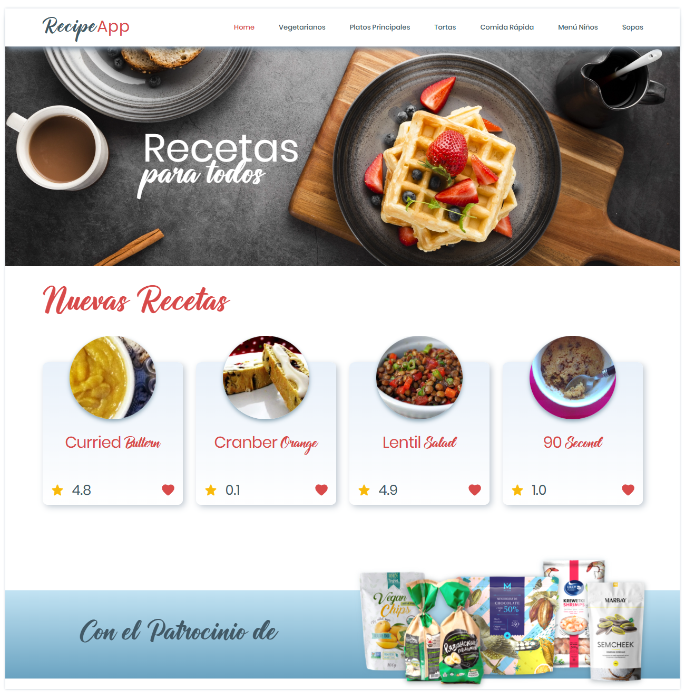
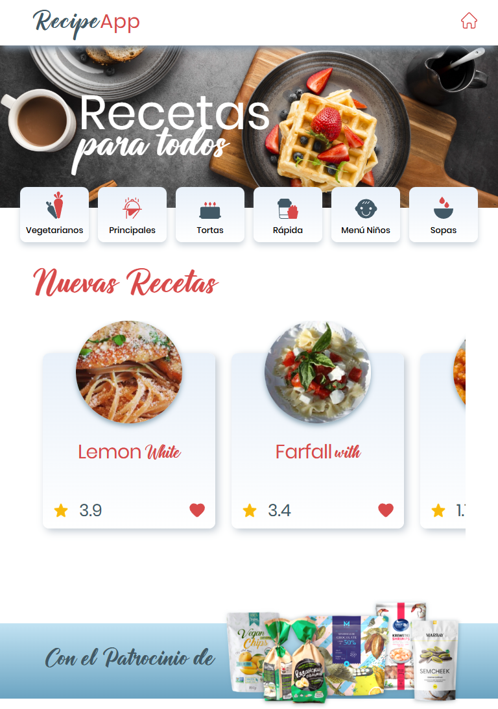
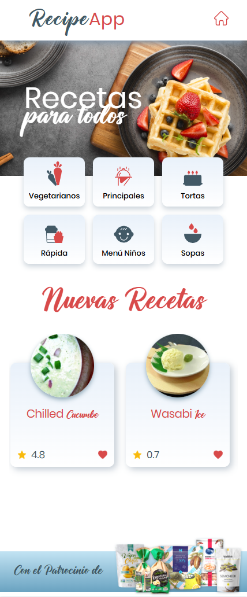

# Recipe App

Plataforma web donde podrás consultar recetas, tendencias del mercado y productos recomendados.
- [Enlace demo Recipe App](https://kamt1128.github.io/recipe-app/)

| Desktop | Table | Mobile |
| :---: | :---: | :---: |
|  |  |  |

## Especificaciones técnicas

- Se utilizo [Vite](https://github.com/vitejs) para la creación de la plantilla de la aplicación con [React](https://es.react.dev/) en su versión 18.3.1 y [Typescript](https://www.typescriptlang.org/).
- [Axios](https://axios-http.com/es/docs/intro) como cliente HTTP para el consumo de la API [https://spoonacular.com/food-api](https://spoonacular.com/food-api/), mediante la implementación de `react-query`.
- `react-context` como estrategia para el manejo de datos de forma transversal a todo el arbol de componentes.
- [SASS](https://sass-lang.com/) como pre-procesador css para el diseño del look and feel.
- [BEM](https://getbem.com/) como metodología de nomenclatura para nombrar las clases de los nodos del arbol html para luego estilizarlos en la escritura del css.

## Paso para ejecutar la aplicación
```js
// Clone project
git clone https://github.com/kamt1128/recipe-app.git
cd recipe-app
// Install dependencies
npm install
// execute code
npm run dev
```
